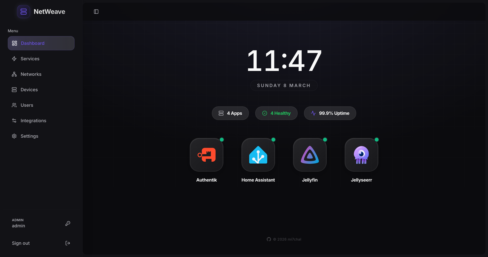
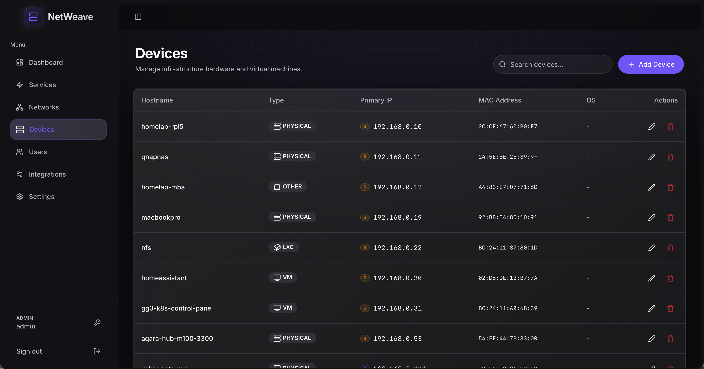
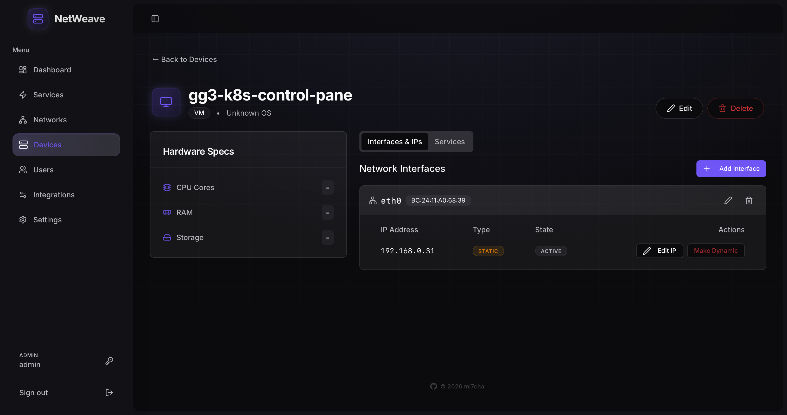
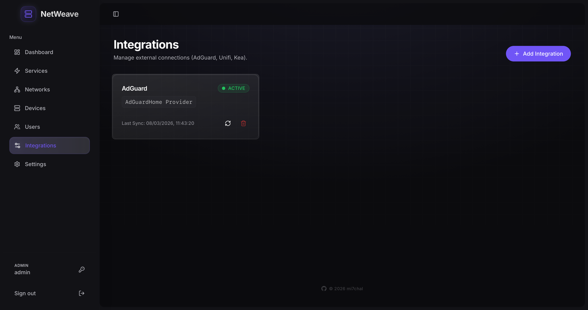

# 🌐 NetWeave

[](https://github.com/mi7chal/netweave/actions/workflows/ci.yml)
[](https://github.com/mi7chal/netweave/actions/workflows/docker-publish.yml)
[](LICENSE)
[](https://hub.docker.com/r/mi7chal/netweave)
[](https://hub.docker.com/r/mi7chal/netweave)
[](https://github.com/mi7chal/netweave)
[](https://github.com/mi7chal/netweave)

**The Lightweight, Modern IPAM & HomeLab Dashboard.**

Built for lightweight and convenient network administration. NetWeave is based on Rust and React — extremely fast, fulfilling all the needs of a modern IPAM and HomeLab dashboard.

---

## ✨ Features

- 🏠︎ **Embedded Homepage**: A customizable public homepage to display your overview, services status and important links.
- 🔌 **Dynamic IPAM**: Comprehensive IP Address Management with support for static and dynamic leases.
- 🖥️ **Device Management**: Track all your hardware with MAC address mapping and IP identification.
- 📡 **AdGuard Integration**: Native sync with AdGuard Home for managing DHCP leases and static assignments.
- 🛠️ **Service Monitoring**: Keep an eye on your local services with real-time status checks.
- 🔐 **Authentication**: Username/password and OIDC SSO support with role-based access control.
- ⚙️ **Settings**: Configurable public homepage and application preferences.
- 🚀 **Secure & Fast**: Powered by **Rust** (Axum) for memory safety and high-concurrency performance. Only uses ~50MB of RAM at idle.

---

## 📸 Screenshots

<p align="center">
  
  &nbsp; &nbsp;
  
</p>

<p align="center">
  
  &nbsp; &nbsp;
  
</p>

---

## 🚀 Quick Start

### Docker Compose (Recommended)

```bash
# Download the compose file and environment template
curl -O https://raw.githubusercontent.com/mi7chal/netweave/main/compose.yaml
curl -O https://raw.githubusercontent.com/mi7chal/netweave/main/.env.example
cp .env.example .env

# Edit .env — set ENCRYPTION_KEY and SESSION_SECRET at minimum
# Generate keys with:  openssl rand -hex 32

# Start NetWeave
docker compose up -d
```

NetWeave will be available at `http://localhost:8789`.

### Kubernetes (Advanced)

For example Kubernetes deployment, see [My Kubernetes Setup](https://github.com/mi7chal/homelab/tree/main/k8s/apps/netweave).

---

## ⚙️ Configuration

| Variable | Description | Default |
|----------|-------------|------------|
| `DATABASE_URL` | PostgreSQL connection string | *required* |
| `DEFAULT_ADMIN_USER` | Initial admin username | `admin` |
| `DEFAULT_ADMIN_PASSWORD` | Initial admin password | `adminpassword` |
| `ENCRYPTION_KEY` | 64-char hex key for secret encryption | *required* |
| `SESSION_SECRET` | Session signing secret | auto-generated |
| `SESSION_SECURE_COOKIE` | Set to `true` when behind HTTPS | `false` |
| `RUST_LOG` | Log level (`debug`, `info`, `warn`) | `info` |
| `OIDC_CONFIGURATION_URL` | OIDC configuration URL | *optional* |
| `OIDC_CLIENT_ID` | OIDC client ID | *optional* |
| `OIDC_CLIENT_SECRET` | OIDC client secret | *optional* |
| `OIDC_REDIRECT_URL` | OIDC callback URL | *optional* |

See [`.env.example`](.env.example) for a full reference.

---

## 🛠️ Development

### Prerequisites

- [Rust](https://www.rust-lang.org/tools/install) (1.94+)
- [Node.js](https://nodejs.org/) 22+ with [pnpm](https://pnpm.io/)
- [Docker](https://www.docker.com/) & Docker Compose

### Setup

```bash
cp .env.example .env
# Edit .env as needed (NETWEAVE_ENV=dev skips ENCRYPTION_KEY requirement)

# Start development dependencies (PostgreSQL + pgweb)
docker compose -f compose.dev.yaml up -d

# Run the backend (terminal 1)
cargo run

# Run the frontend (terminal 2)
cd web && pnpm install && pnpm dev
```

- **Backend**: `http://localhost:8789`
- **Frontend dev server**: `http://localhost:5173` (proxies API to backend)
- **pgweb**: `http://localhost:8081`

See [CONTRIBUTING.md](CONTRIBUTING.md) for the full contributor guide.

---

## 🏗️ Tech Stack

### Backend
- **Core**: [Rust](https://www.rust-lang.org/) / [Axum](https://github.com/tokio-rs/axum)
- **Database**: [PostgreSQL](https://www.postgresql.org/) with [SQLx](https://github.com/launchbadge/sqlx) & [SeaORM](https://www.sea-orm.com/)
- **Runtime**: [Tokio](https://tokio.rs/)

### Frontend
- **Framework**: [React](https://reactjs.org/) / [Vite](https://vitejs.dev/)
- **Styling**: [Tailwind CSS](https://tailwindcss.com/) / [Shadcn UI](https://ui.shadcn.com/)
- **Animations**: [Framer Motion](https://www.framer.com/motion/)

---

## 🔒 Security

Found a vulnerability? Please see [SECURITY.md](SECURITY.md) for responsible disclosure instructions.

## 🤝 Contributing

NetWeave welcomes all contributions! See [CONTRIBUTING.md](CONTRIBUTING.md) for guidelines.

## 📋 Changelog

See [CHANGELOG.md](CHANGELOG.md) for release history.

## 🤖 AI Transparency

This project utilized AI assistance during development. However, all code was manually reviewed, cleaned up, and tested by the author to ensure reliability and security.

---

© 2026 [mi7chal](https://github.com/mi7chal). Distributed under the [Apache License 2.0](LICENSE).
