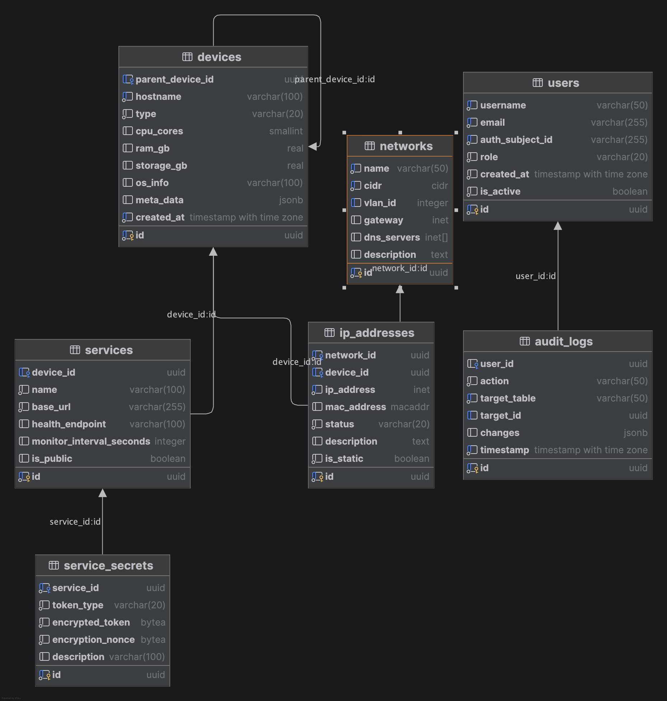

# Dokumentacja Bazy danych lab lista 5
**Autor:** Michał Chruścielski

---

## Wstęp
Niniejsza dokumentacja opisuje strukturę aplikacji Homelab Manager, która skupiając się na części bazy danych implementuje
prosty system IPAM (IP Address Management) oraz dashboard do monitorowania stanu sieci domowej.

### Cel
Celem projektu jest stworzenie aplikacji, która pozwoli zarządzać siecią domową (np. adresami statycznymi), co pozwoli 
na uniknięcie konfliktów bez wymuszania dzierżaw DHCP na urządzeniach serwrowych. Dodatkowo aplikacja 
oferuje zapis serwisów, czyli dowolnych usług działających w sieci jak np. serwer DNS, WWW czy inne.

Dzięki relacyjnej bazie danych apliakcja przechowuje informacje o sieci, serwerach, usługach i zapewnia ich spójność.

### Technologie

Ze względu na możliwość przyszłej rozbudowy i charakterystyke aplikacji wybrano:
* **Backend:** Rust (Axum/Actix)
* **Frontend:** HTMX
* **Baza danych:** PostgresSQL

---

## Użytkownicy
Ze względu na praktyczne ograniczenia języka `Rust` oraz popularnych bibliotek (`sqlx`), w których standardem jest używanie
struktury [Pool](https://docs.rs/sqlx/latest/sqlx/struct.Pool.html) w implemntacji systemu użyto jednego użytkownika bazy danych z pełnymi uprawnieniami do zarządzania bazą. Stworzono natomiast role użytkoników, które działają na poziomie aplikacji.

System przewiduje dwa poziomy dostępu:

### Administrator (admin)
Posiada pełne uprawnienia do systemu.

**Uprawnienia:**
* Dostęp do wszystkich funkcji aplikacji, usuwania, edycji i dodawnia zasobów.
* Zarządzanie konfiguracją systemu.

### Użytkownik (Viewer)
Posiada dostęp tylko do odczytu części danych (dashboardu).

**Uprawnienia:**
* Może wejść tylko na stronę główną, zobaczyć status serwisów i przejść do nich poprzez linki.
* Nie ma możliwości edycji, usuwania ani dodawania zasobów.

---

## Model bazy danych
Deklaracja bazy danych została stworzona w pliku [schema.sql](../src/schema.sql).

Poniżej przedstawiono schemat bazy danych wygenerowany w DataGrip.

### Encje
Baza składa się z następujących encji:
* users
* networks
* devices
* interfaces
* ip_addresses
* services
* services_secrets (na ten moment nieużywana)
* audit_logs

Szczegółowy opis encji znajduje się w sekcji poniżej. 

#### Tabela `users`
Przechowuje informacje o użytkownikach.

* **Klucze obce**: Brak
* **Indeksy**: `username`, `email`

#### Tabela `networks`
Przechowuje informacje o sieciach zarządzanych przez aplikację. Teoretycznie jest to aplikacja homelab, jednak standardem
w środowisku rozbudowanych sieci domowych jest posiadanie wielu podsieci (VLANów).

* **Klucze obce**: Brak
* **Indeksy**: `cidr`

#### Tabela `devices`
Przechowuje informacje o fizycznych lub wirtualnych urządzeniach w sieci (np. router, serwer, VM). Urządzenia można w aplikacji
przeszukiwać stąd duża ilość indeksów.

* **Klucze obce**: Brak
* **Indeksy**: `hostname`, `parent_device_id`, `created_at`, `name`

#### Tabela `interfaces`
Przechowuje informacje o interfejsach sieciowych urządzeń. Nie jest to tabela konieczna (możaby przypisywać adresy do urządzeń), ale dzięki niej struktura jest odwzorowana adekwatnie. Automatycznie przypisuje interfejsy do urządzeń dzięki triggerowi `trigger_auto_link_interface_mac`.

* **Klucze obce**: `device_id`
* **Indeksy**: `device_id`, `mac_address`

#### Tabela `ip_addresses`
Przechowuje informacje o statycznych i dynamicznych adresach IP. Automatycznie przypisuje adresy do interfejsów dzięki triggerowi `trigger_auto_link_ip_mac`.

* **Klucze obce**: `network_id`, `interface_id`
* **Indeksy**: `network_id`, `interface_id`

#### Tabela `services`
Przechowuje informacje o usługach działających w sieci (np. serwer DNS, WWW). Dzięki polom `url` i `port` aplikacja w przyszłości może być rozszerzona o monitoroowanie stanu usług.

* **Klucze obce**: `device_id`, `service_secrets_id`
* **Indeksy**: `device_id`, `service_secrets_id`

#### Tabela `services_secrets`
Przechowuje informacje o sekretach usług (np. hasła, tokeny). Na ten moment nie jest używana.

#### Tabela `audit_logs`
Przechowuje informacje o operacjach wykonywanych w systemie (np. dodawanie, usuwanie zasobów). Jest podłączona do bazy za pomocą triggerów, które automatycznie zapisują operacje.

* **Klucze obce**: `user_id`
* **Indeksy**: `target_id`, `timestamp`, `target_table`

---

### Normalizacja
Baza danych została znormalizowana do 3NF, co oznacza, że całość danych jest pośrednio lub bezpośrednio zależna od kluczy głównych. 

**Redundancja adresów fizycznych:**
Adres MAC znajduje się w tabeli `interfaces` oraz `ip_addresses`, ale nie jest to redundancja w klasycznym sensie - interfejs może mieć swój adres MAC, a dzierżawa adresu IP może być przypisana do innego adresu MAC. To sprawia, że niejako każda z tych tabel posiada swój odrębny MAC.

Jedynym wyjątkiem jest tutaj poprawnie zlinkowany interface z dzierżawą. Wtedy adres fizyczny urządzenia jest faktycznie powielony, spójność jest tu jednak zapewniona przez trigger.

**Odniesienie do samego siebie:**
Tabela `devices` odnosi się do samej siebie w kolumnie `parent_device_id`, jednak jest to działanie celowe. Czasem np. kilka maszyn wirtualnych działa na jednym hoście fizycznym, co można odwzorować właśnie dzieki temu odniesiniu

---

## Spójność danych
W celu zapewnienia spójności danych i wygody obsługi bazy z poziomu kodu zapewniono następujące mechanizmy.

Dodatkowo dzięki użyciu biblioteki `sqlx` w kodzie Rust, aplikacja ma specjalne struktury powiązane z bazą, które zapewniają bezpieczny i spójny dostęp do informacji także z poziomu kodu. Co więcej, biblioteka ta wymusza compiile-time check, czyli zapytania są **sprawdzane już w momenci kompilacji**.

### Triggery 
* Zapewniają spójność adresów MAC
* Logują eventy w aplikacji.

### Transakcje
Operacje złożone są realizowane z użyciem transakcji wywoływanych z poziomu kodu `self.pool.begin()`. 

Przykładowa implementacja znajduje się w pliku [src/db/mod.rs](../src/db/mod.rs) oraz [src/db/device.rs](../src/db/device.rs) w funkcji `create_device()`.

---

## Bezpieczeństwo

### Przechowywanie haseł
Hasła użytkowników hashowane są z użyciem `bcrypt`.

### SQL Injection
Aplikacja wykorzystuje bibliotekę `sqlx`, która dzięki parametrom zapewnia ochronę przez wstrzykiwaniem SQL.
